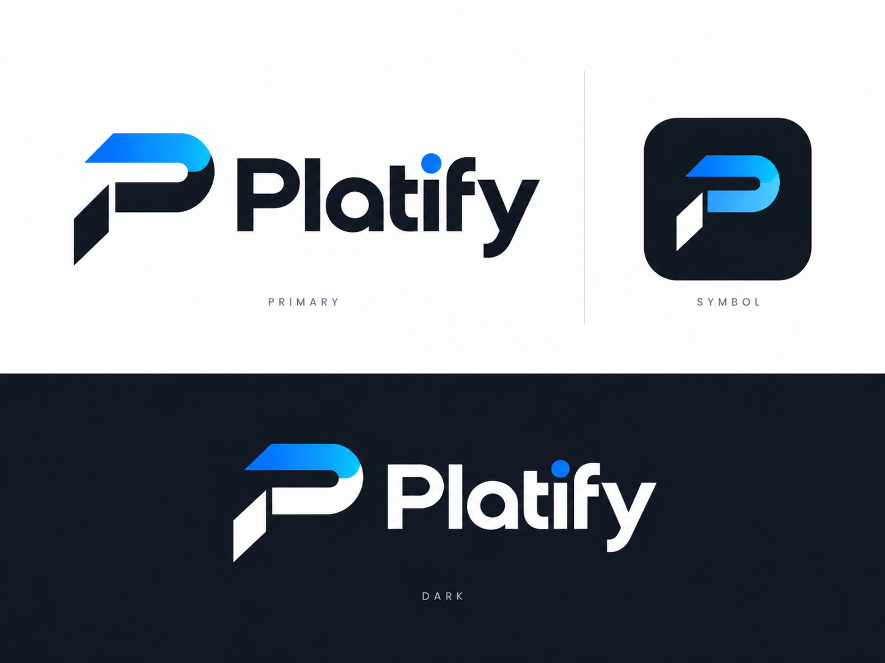

# Platify

Fundação arquitetural do Platify em Next.js 16, organizada como monólito modular com DDD pragmático. Esta etapa estabelece diretórios, fronteiras e tooling; catálogo, Guide Studio, progresso e demais funcionalidades de produto ainda não estão implementados.



## Stack

- Next.js 16 App Router, React e TypeScript strict;
- Tailwind CSS 4 e shadcn/ui sobre Base UI;
- PostgreSQL, Drizzle ORM e migrations versionadas;
- Supabase Auth e Storage;
- Zod para configuração tipada;
- pnpm e Vercel.

## Estrutura

```text
.
├── drizzle/                    # única origem de migrations SQL
├── public/
│   └── brand/
├── scripts/                    # rotinas operacionais fora do runtime
├── src/
│   ├── app/                    # rotas e composição
│   │   └── (public)/
│   ├── components/
│   │   ├── brand/
│   │   ├── feedback/
│   │   ├── layout/
│   │   └── ui/
│   ├── config/                 # env, site e rotas
│   ├── db/                     # cliente, transações e schema Drizzle
│   │   └── schema/
│   ├── infrastructure/
│   │   └── supabase/
│   ├── modules/
│   │   ├── catalog/
│   │   ├── guides/
│   │   ├── identity/
│   │   ├── media/
│   │   ├── progress/
│   │   └── search/
│   └── shared/                 # utilitários realmente genéricos
└── tests/
    └── integration/
```

Diretórios de camada (`domain`, `application`, `infrastructure`, `delivery`) e APIs públicas (`contracts.ts`, `server.ts`, `ui.ts`) devem ser adicionados dentro de um módulo apenas quando houver implementação real. Não há pastas vazias ou barrels artificiais para simular maturidade que o produto ainda não possui.

## Fronteiras

O fluxo de dependências dentro de um módulo é:

```text
Delivery / UI -> Application -> Domain
                         ^
                         |
                 ports <- Infrastructure
```

Regras centrais:

- `src/app` compõe APIs públicas dos módulos e nunca acessa Drizzle/DB diretamente;
- `domain` é TypeScript puro e não importa React, Next.js, Drizzle, Supabase ou infraestrutura;
- outro módulo só é consumido por `contracts.ts`, `server.ts` ou `ui.ts`, conforme a camada;
- `src/db` não depende de módulos ou UI;
- Server Components são o padrão; Client Components explícitos usam `*.client.tsx` quando a convenção do Next.js não exige outro nome;
- secrets ficam em `env.server.ts` e arquivos server-side usam `server-only`;
- não existe módulo `admin`: páginas administrativas futuras serão apenas uma delivery dos módulos existentes.

O ESLint aplica essas fronteiras por camada. `tests/integration/repository-boundaries.test.ts` cobre invariantes estruturais que atravessam arquivos, incluindo imports internos entre módulos, acesso direto a env, suffix de Client Components e localização de SQL.

## Banco e migrations

O schema Drizzle é dividido por domínio em `src/db/schema`. O fluxo oficial é:

```text
src/db/schema -> pnpm db:generate -> revisão em drizzle/ -> pnpm db:migrate
```

`drizzle push` não deve ser usado para produção. Ainda não existem tabelas nem migrations porque a modelagem funcional pertence às próximas etapas.

## Ambiente local

Requisitos: Node.js 22+ e pnpm compatível com a versão registrada no `package.json`.

```bash
cp .env.example .env.local
pnpm install
pnpm dev
```

As credenciais de banco e Supabase são validadas sob demanda. Assim, lint, testes e build da fundação não exigem secrets; qualquer operação que realmente use DB ou Supabase falha cedo se a configuração necessária estiver ausente.

O `pnpm-workspace.yaml` contém somente a política de builds de dependências exigida pelo pnpm 12. Não há outros packages e o projeto continua sendo um repositório single-package, não um monorepo.

## Qualidade

```bash
pnpm lint
pnpm typecheck
pnpm test
pnpm build
```

Testes unitários ficam junto do código (`*.test.ts`), integrações em `tests/integration` e E2E futuros em `tests/e2e` com `*.spec.ts`.
